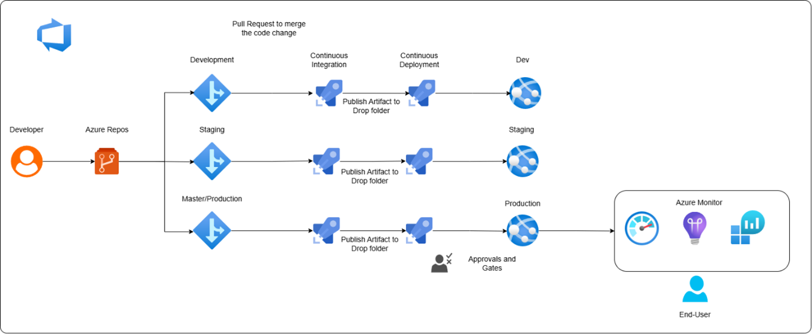

# CI/CD Pipeline for .NET Web Application using Azure DevOps

## 🚀 Project Overview

This project demonstrates how to implement a full CI/CD pipeline using Azure DevOps for a .NET web application. It includes automated build, testing, deployment to multiple environments (Dev, Staging, Prod), manual approval gates, and monitoring using Azure Monitor and Application Insights.

---

## 🎯 Objectives

- ✅ Store and manage source code using Azure Repos (Git)
- ✅ Set up CI pipeline to restore dependencies, build, and run unit tests
- ✅ Configure CD pipeline for automated deployment to Dev, Staging, and Production
- ✅ Implement approval gates before production deployments
- ✅ Enable monitoring using Azure Monitor and Application Insights

---

## 🏗️ Architecture Diagram

---

## 🔧 Prerequisites

- A .NET application hosted on GitHub: [`newlocalrepo`](https://github.com/merranbo1989/newlocalrepo.git)
- Azure App Services with 3 slots: **Dev**, **Staging**, **Production**
- Azure DevOps Organization and Project setup

---

## ⚙️ Solution Breakdown

### 1️⃣ Source Code Management

- Created a DevOps project and imported the GitHub repo
- Branching strategy:
  - `master`: Production-ready code
  - `dev`: Development branch
  - `staging`: UAT/Test environment
  - `feature/*`: Feature updates, merged into `dev`

---

### 2️⃣ Continuous Integration (CI)

- Created a build pipeline using the Azure DevOps ASP.NET template
- YAML pipeline includes:
  - NuGet restore
  - Build with MSBuild
  - Unit test with `DotNetCoreCLI`
  - Publish build artifacts

🔧 Sample YAML Snippet

### 3️⃣ Continuous Deployment (CD)
Separate release pipelines for each environment:
  - Dev: Automatic deployment on build success
  - Staging: Triggered after successful Dev deployment
  - Production: Triggered post-manual approval

### 4️⃣ Manual Approval Gates
  - Configured pre-deployment approval for Production environment
  - Ensures controlled and verified releases

### 5️⃣ Execution and Validation
Code push to dev triggers:
  - Build pipeline → Unit Tests → Artifact creation
  - Dev → Staging → Manual Approval → Production
Verified deployment via app service URLs

### 6️⃣ Monitoring
Enabled Application Insights in the Production slot
Integrated with Azure Monitor for:
  - Performance metrics
  - Failure tracking
  - Real-time insights

# ✅ Outcomes
  ### End-to-end automation of build → test → deploy
  ### Improved code quality through testing and approval gates
  ### Real-time production monitoring using Azure-native tools

# 🏷️ Tags
###   Azure DevOps CI/CD .NET App Service YAML Application Insights Cloud Automation
