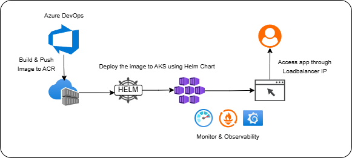

# 🚀 CI/CD for Containerized .NET App on AKS with Helm and Azure DevOps

## 📌 Project Overview

This project demonstrates how to automate the deployment of a containerized .NET Blazor application to **Azure Kubernetes Service (AKS)** using **Azure DevOps CI/CD pipelines** and **Helm charts**. It also integrates **Azure Monitor, Prometheus, and Grafana** for observability and real-time health metrics.

---

## 🎯 Objectives

- 📦 Containerize a .NET Blazor App using Docker
- ⚙️ Build & push Docker image to **Azure Container Registry (ACR)**
- 🚀 Deploy to **AKS** using **Helm**
- 🔄 Automate CI/CD with **Azure Pipelines**
- 📊 Enable observability with **Azure Monitor, Prometheus, Grafana**

---

## 🏗️ Architecture Diagram

---

## 🔧 Prerequisites

- GitHub Repo for .Net app: [https://github.com/merranbo1989/BCP-P2.git](https://github.com/merranbo1989/BCP-P2.git)
- Azure Container Registry (ACR) created and configured
- Azure Kubernetes Service (AKS) cluster
- Azure DevOps project set up with service connections

---

## ⚙️ Solution Summary

### 1️⃣ Containerize the Application
- Use DockerFile to Containerize the .net application

  🔧Dockerfile: [Dockerfile](Project2_Dockerfile.txt)

### 2️⃣ CI/CD Pipeline (Azure DevOps)
- Setup the CI/CD to build & push the Docker Image to ACR
- Create Helm Charts
- Deploy the Images to different namespaces: **Dev**, **Staging**, **Production**

  🔧 CI/CD Yaml Snippet: [azurepipelines.yml](azurepipelines.yml)

# ✅ Validation Steps
- Verify Docker image in Azure Container Registry
- Confirm deployment to AKS namespace using the below commands:
	- kubectl get pods
	- kubectl get services
- Access the app using the Load Balancer IP:

# 📊 Monitoring & Observability
### 🔹 Azure Monitor + Application Insights
- Enabled metrics for AKS and container workloads
  
### 🔹 Prometheus
- Tracks custom and system metrics
  
### 🔹 Grafana
- Connected to Prometheus
- Dashboard created for:
	- Pod performance
 	- Resource usage
  	- Response times

# ✅ Outcomes
  ### End-to-end automation of build → test → deploy a containarized .Net application
  ### Deploy to Azure Kubernetes Service (AKS) using Azure DevOps and Helm Chart
  ### Real-time production monitoring using Azure Monitor, Prometheus, and Grafana

# 📸 Report & Screenshots
   ### [Project2_Report](Report_Project2.pdf)
  
# 🏷️ Tags
   `Azure` `DevOps` `Docker` `Helm` `Kubernetes` `AKS` `.NET` `CI/CD` `Observability` `Prometheus` `Grafana`
