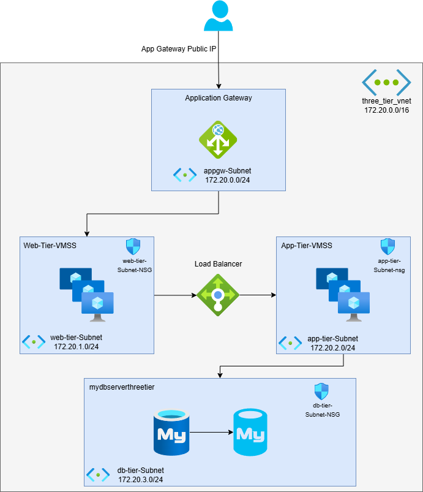

# ☁️ Automate Azure Infrastructure Provisioning with Terraform and Azure DevOps (Multi-Environment Setup)

## 📌 Project Overview

This project demonstrates how to implement **Infrastructure as Code (IaC)** using **Terraform** integrated with **Azure DevOps Pipelines** to provision and manage a **secure and highly available three-tier architecture** (Web, App, DB) across **Dev, Stage, and Production environments** using workspaces.

---

## 🎯 Objectives

- 🏗️ Build a reusable three-tier architecture using Terraform
- 🛠️ Use workspaces to manage multiple environments (Dev, Stage, Prod)
- 💾 Manage Terraform state files securely in Azure Storage
- 🔄 Automate validation, plan, and apply steps using Azure DevOps pipelines
- 🔐 Ensure secure and scalable deployment with NSGs, Key Vault, VM Scale Sets, Load Balancers, and MySQL

---

## 🧱 Architecture Diagram

 <!-- Adjust this path if needed -->

---

## 🔧 Prerequisites

- GitHub Repo: [`https://github.com/merranbo-git/bcpp3-terraform`](https://github.com/merranbo-git/bcpp3-terraform)
- Azure DevOps project and pipeline setup
- Azure Storage Account and container for Terraform state backend

---

## 🧰 Tools & Technologies

| Tool             | Purpose                                    |
|------------------|--------------------------------------------|
| Terraform        | Infrastructure as Code                     |
| Azure DevOps     | CI/CD pipeline orchestration               |
| Azure Resources  | VMs, VNets, NSGs, VMSS, App Gateway, MySQL |
| Azure Key Vault  | Secret management                          |
| Workspaces       | Multi-environment deployments              |

---

## 🚀 Features

- Multi-environment pipeline using Terraform workspaces
- Secure state file management with Azure backend
- Application Gateway for external traffic
- Internal Load Balancer for App <-> Web communication
- Auto-scaling enabled for VM Scale Sets
- Custom startup scripts and MySQL integration for App tier

---

## 📂 Repository Structure

```
bcpp3-terraform/
├── main.tf
├── variables.tf
├── A_Dev.tfvars
├── A_Stage.tfvars
├── A_Prod.tfvars
├── Scripts/
│ ├── web_init.sh
│ └── node_server.sh
├── VM_Key/
│ ├── web-ssh-key.pub
│ └── app-ssh-key.pub
└── README.md
```

---

## ⚙️ Azure DevOps Pipeline (YAML Overview)

- Each stage uses a different **Terraform workspace** and `.tfvars` file
- State files are stored in an Azure Storage Account container

### 🔁 Pipeline Stages

*Sample YAML Snippet:*
```
stages:
  - stage: Dev
    variables:
      env: 'Dev'
      bkkey: 'dev.terraform.tfstate'
      varfile: 'A_Dev.tfvars'

  - stage: Stage
    condition: succeeded('Dev')
    variables:
      env: 'Stage'
      bkkey: 'stage.terraform.tfstate'
      varfile: 'A_Stage.tfvars'

  - stage: Prod
    condition: succeeded('Stage')
    variables:
      env: 'Prod'
      bkkey: 'prod.terraform.tfstate'
      varfile: 'A_Prod.tfvars'
```

---

### ✅ Validation Steps
- Verify the deployment of resources (VMSS, App Gateway, MySQL, etc.) in Azure Portal
- Confirm NSG rules, IP addresses, and VM Scale Set startup scripts are applied
- Access application via public IP from App Gateway
- Review workspace tags and logs from the pipeline

---

### 📊 Sample Terraform Resources
- Resource Group, VNet & Subnets
- App Gateway & Public IP
- Web & App VM Scale Sets (with startup scripts)
- NSGs per subnet
- Internal Load Balancer
- Azure Key Vault for secrets
- MySQL Flexible Server with secure access

---

### 💥 Bonus: Terraform Destroy Pipeline
Create a separate Azure DevOps pipeline or stage with terraform destroy logic for each workspace to clean up environments.

---

###🔐 Security Notes
- Secrets like DB passwords are stored in Azure Key Vault
- VMs communicate over internal IPs only
- NSG rules restrict access based on subnet roles

---

# 📸 Report & Screenshots
   ### [Project3_Report](Report_Project3.pdf)

---

#🏷️ Tags
`Terraform` `Azure DevOps` `IaC` `Azure Infrastructure` `Three-Tier Architecture` `Workspaces` `CI/CD` `Key Vault` `VM Scale Sets`
