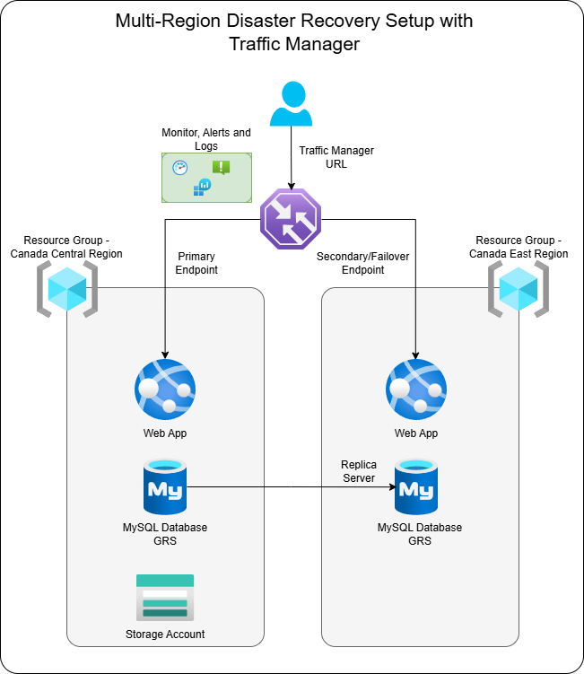

# 🌍 Multi-Region Disaster Recovery on Azure with Traffic Manager

## 📌 Project Overview

This project demonstrates how to implement a **highly available and fault-tolerant multi-region disaster recovery setup** on Microsoft Azure. It involves deploying a .NET web application in two different Azure regions and configuring **Azure Traffic Manager** to ensure automatic failover in case of regional outages. The backend is powered by **Azure SQL with Geo-Replication** and **Azure Storage with GRS** to ensure data resiliency.

---

## 🎯 Objectives

- 🌐 Deploy web apps in **Canada Central** (Primary) and **Canada East** (Secondary)
- 🗃️ Set up **Azure SQL Flexible Server** with geo-replication across regions
- 📂 Configure **Azure Storage Account** with **Geo-Redundant Storage (GRS)**
- 🔀 Implement **Azure Traffic Manager** with **priority-based routing**
- 🧪 Simulate failover by stopping the primary app and verifying redirection
- 🔔 Set up **Azure Monitor alerts** for endpoint health

---

## 🏗️ Architecture Diagram

 <!-- Adjust path as needed -->

---

## 🔧 Prerequisites

- Azure subscription with permissions to deploy resources
- Sample .NET app: [`https://github.com/merranbo1989/BCP-P2.git`](https://github.com/merranbo1989/BCP-P2.git)
- Resource groups created in both `Canada Central` and `Canada East`

---

## ⚙️ Solution Steps

### 1️⃣ App Deployment

- Create Web Apps in **Canada Central** and **Canada East**
- Deploy the sample .NET app to both regions
- Validate both app instances are accessible independently

---

### 2️⃣ Backend Setup

- Create **Azure SQL Flexible Server** in Canada Central with Geo-Replication
- Deploy replica server in Canada East
- Ensure data consistency and connection from web apps

---

### 3️⃣ Storage Account Setup

- Create a **Storage Account** with GRS in Canada Central
- Upload sample file (e.g., `.txt`, `.png`) to test cross-region availability

---

### 4️⃣ Configure Azure Traffic Manager

- Create a **Traffic Manager Profile** with routing method: `Priority`
- Add endpoints:
  - Primary: App Service in Canada Central
  - Secondary: App Service in Canada East
- Validate accessibility via Traffic Manager endpoint

---

### 5️⃣ Failover Simulation

- Manually stop the **primary app service** (Canada Central)
- Access Traffic Manager URL and verify it redirects to the **secondary app** in Canada East

---

### 6️⃣ Monitoring & Alerts

- Enable **Azure Monitor**
- Configure **Alerts** and **Action Groups** to notify on:
- App service failures
- Traffic Manager endpoint degradation
- Validate real-time alerts during failover test

---

## ✅ Outcome

- Traffic is automatically routed to the healthy region during failures
- Application remains available across both regions
- Real-time notifications are triggered during outages
- Data and backend remain consistent and accessible

---

# 📸 Report & Screenshots
   ### [Project4_Report](Report_Project4.pdf)

---

## 🏷️ Tags

`Azure` `Traffic Manager` `Geo-Replication` `High Availability` `Azure SQL` `Disaster Recovery` `Azure Monitor` `DevOps`
