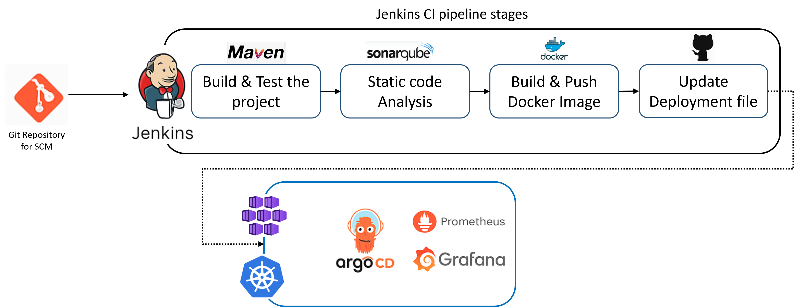

# ☕ Enterprise Java CI/CD with Jenkins, GitOps, and Kubernetes Observability

## 📌 Project Overview

This project demonstrates a full DevOps pipeline for a Java microservice using open-source tools like **Jenkins**, **SonarQube**, **Docker**, **Argo CD**, **Prometheus**, and **Grafana**. The goal is to build, test, containerize, and deploy the application on Azure Kubernetes Service (AKS) with complete observability and GitOps principles.

---

## 🎯 Objectives

- Automate CI/CD using Jenkins pipelines
- Enforce quality gates with SonarQube for static code analysis
- Build and push Docker images of the Java app
- Use GitOps (Argo CD) to deploy to AKS from Git
- Enable observability with Prometheus and Grafana

---

## 🏗️ Architecture Diagram

 <!-- Adjust this path as needed -->

---

## 🔧 Prerequisites

- GitHub repo with Java project: [`https://github.com/merranbo1989/BCP-P5`](https://github.com/merranbo1989/BCP-P5)
- An Ubuntu VM with:
  - Jenkins
  - Maven
  - SonarQube (Dockerized)
  - Docker
- Azure Kubernetes Service (AKS) cluster
- Jenkins, Docker Hub, GitHub, and SonarQube credentials

---

## ⚙️ Solution Summary

### 🔨 Project Setup

- Install Jenkins, Docker, Maven, Git, Java JDK
- Install and configure SonarQube using Docker
- Configure Jenkins and SonarQube dashboards

---

### 🔁 CI Pipeline (Jenkins)

- Triggered on GitHub push
- Stages:
  - Checkout source code
  - Build and test with Maven
  - SonarQube analysis
  - Docker image build and push to Docker Hub
  - Update `deployment.yml` in Git with new image tag
- 🔧Pipeline Script File: [Jenkinsfile](Jenkinsfile.txt)

---

### 🚀 CD Pipeline (GitOps via Argo CD)
- Argo CD installed on AKS
- Configured to watch the Git repo for deployment manifest changes
- Automatically deploys updated Docker image using `deployment.yml`

---

### 📊 Monitoring & Observability
- Prometheus installed in AKS for metric collection
- Grafana configured with dashboards for:
- CPU, Memory usage
- Pod health
- Response time, errors

---

# 📂 Repository Structure 

```
BCP-P5/
├── java-maven-sonar-argocd-helm-k8s/
│   ├── spring-boot-app/  			  # Java app source
│       └── JenkinsFile               # Jenkins pipeline
│   ├── spring-boot-app-manifests/    # Kubernetes manifests   
├── README.md
```

### 🔍 Validation Checklist
- ✅ Jenkins pipeline runs successfully
- ✅ SonarQube dashboard shows code quality metrics
- ✅ Docker image is published to Docker Hub
- ✅ Argo CD UI shows synced app state with Git
- ✅ Kubernetes app runs on AKS with correct version
- ✅ Grafana dashboard displays real-time metrics

---

# 📸 Report & Screenshots
   ### [Project5_Report](Report_Project5.pdf)

---

### 🏷️ Tags
`Jenkins` `CI/CD` `GitOps` `Argo CD` `Java` `SonarQube` `Docker` `AKS` `Kubernetes` `Prometheus` `Grafana`

